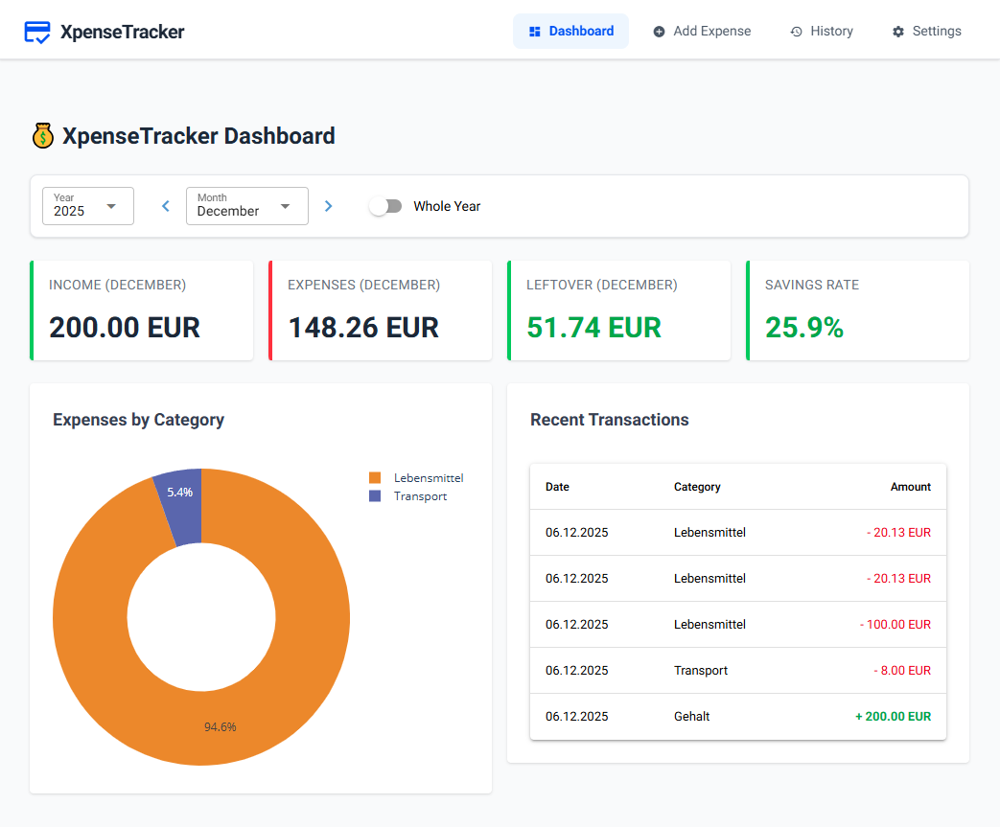

# XpenseTracker 💰

A self-hosted, Python-based expense and income tracking application with AI receipt scanning.



## Features
- **Modern UI**: Built with the web-based NiceGui framework.
- **Financial Dashboard**: Overview of your income, expenses, balance, and savings rate with interactive charts.
- **AI Receipt Scanning**: Upload a receipt and let AI extract the details automatically.
- **Income & Expense Tracking**: Log both earnings and spendings.
- **Transaction History**: View all your transactions with inline editing capabilities.

## Tech Stack
- **Frontend**: NiceGui
- **Backend**: Python, FastAPI, SQLAlchemy
- **Database**: PostgreSQL
- **AI**: Google Gemini API / OpenAI API

## Installation Setup

1.  **Clone the repository**.
2.  **Configure Environment**:
    - Rename `.env.example` to the active configuration file `.env` and fill in the required content, including any necessary **API keys**.

3.  **Run with Docker**:
    ```bash
    docker compose up --build
    ```
4.  **Access the App**:
    - Open your browser and navigate to `http://localhost:8501`.

## Development Setup

1.  **Create Virtual Environment**:
    ```bash
    python -m venv .venv
    ```

2.  **Activate Virtual Environment**:
    - **Windows (PowerShell)**:
        ```powershell
        .venv\Scripts\Activate.ps1
        ```
    - **Linux/macOS**:
        ```bash
        source .venv/bin/activate
        ```

3.  **Install Dependencies**:
    ```bash
    pip install -r requirements.txt
    ```

4.  **Run Tests**:
    <br>
    See [tests/README.md](tests/README.md) for detailed testing instructions.
    ```powershell
    & ".venv/Scripts/python.exe" -m pytest tests/
    ```